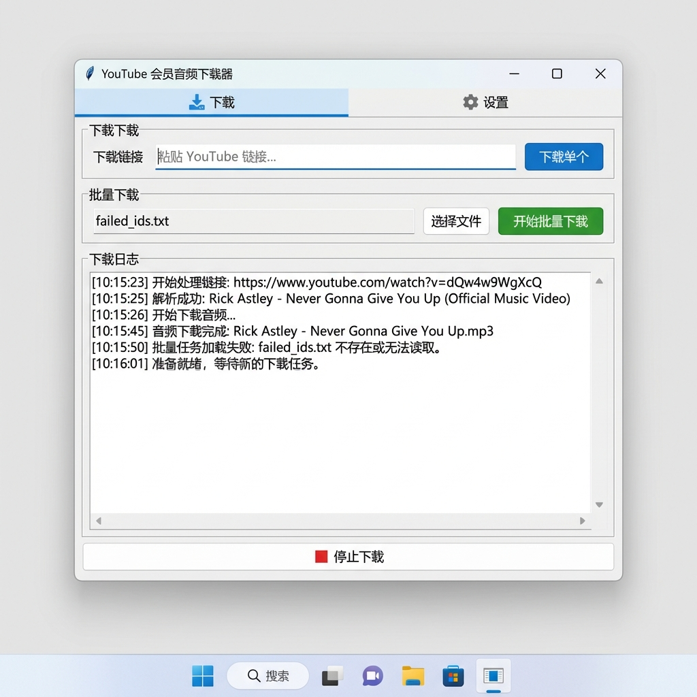

# YouTube Member Audio Downloader

🎵 批量下载 YouTube 会员专属音频 | Batch download YouTube Members-only audio with cookie authentication


## 📸 软件截图



## 🚀 下载安装

### ⚡ 灵巧版 (Lite) - 推荐
体积仅 **10MB**，首次运行时会自动下载必要组件。

1. 前往 [Releases](https://github.com/dearhua26/youtube-member-audio-dl/releases) 页面
2. 下载 `YouTubeAudioDownloader-v1.0.0-Lite.zip`
3. 解压后运行 `YouTubeAudioDownloader.exe`
4. **注意**：首次运行会弹出 "正在配置环境" 窗口，请耐心等待组件下载完成。

### 📦 完整版 (Full)
体积约 186MB，内置所有组件，断网可用。

- 下载 `YouTubeAudioDownloader-v1.0.0-Full.zip`

---

## 🎯 这是什么？

一个专为下载 **YouTube 会员专属内容** 设计的工具：

- 📥 通过 **Cookie 认证** 下载需要登录/会员才能访问的音频
- 🎵 直接获取高质量 **M4A 音频格式**，无需下载视频
- 📝 下载的音频可配合 [Whisper](https://github.com/openai/whisper) 等项目 **自动生成字幕**

## ✨ 功能特性

### 下载模式
- 🎯 **单视频下载**：粘贴链接即可下载
- 📋 **批量下载**：支持从文本文件批量读取链接列表

### 核心功能
- 🔐 **Cookie 认证**：支持会员/付费内容下载
- 🎵 **纯音频提取**：优先 M4A 格式，跳过视频下载
- 🖼️ **封面嵌入**：自动下载并嵌入专辑封面
- 🔄 **断点续传**：自动跳过已下载文件
- 🛡️ **智能诊断**：遇到错误自动生成修复指南
- 🖥️ **图形界面**：简洁易用的 GUI 操作

## 📖 使用指南

### 首次使用

1. 在浏览器安装 [Get cookies.txt LOCALLY](https://chromewebstore.google.com/detail/get-cookiestxt-locally/cclelndahbckbenkjhflpdbgdldlbecc) 插件
2. 登录 YouTube 会员账号，导出 cookies
3. 在软件设置页粘贴 cookies 内容
4. 输入视频链接开始下载

## 🎤 配合字幕生成

下载的 M4A 音频可以直接用于语音转文字：

```bash
# 使用 OpenAI Whisper
whisper your_audio.m4a --language Chinese --model medium
```

## 📄 许可证

[MIT License](LICENSE)
