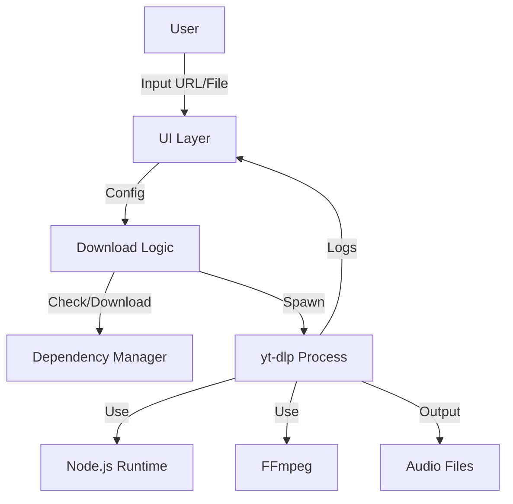

# Technical Architecture

This document describes the high-level architecture of the YouTube Audio Downloader Pro.

## System Overview

The system is designed as a Python-based desktop application wrapper around `yt-dlp`, with specific optimizations for YouTube audio downloading and cookie-based authentication.

### Core Components

1.  **UI Layer (`downloader_ui.py`)**
    *   Built with `tkinter`.
    *   **DownloaderApp**: Main application controller.
    *   **Tabs**: `DownloadTab` (Interaction), `SettingsTab` (Configuration).
    *   **DependencyManager**: Handles startup checks and auto-downloading of binaries (`node.exe`, `ffmpeg.exe`, `yt-dlp.exe`).

2.  **Logic Layer**
    *   **Threading**: All downloads run in background threads to prevent UI freezing.
    *   **Subprocess Management**: Uses `subprocess.Popen` to invoke `yt-dlp` and capture stdout/stderr in real-time.

3.  **External Dependencies (Binaries)**
    *   **yt-dlp**: The core engine for video extraction.
    *   **Node.js**: Required by `yt-dlp` to solve YouTube's "n challenge" (JavaScript verification).
    *   **FFmpeg**: Used for extracting audio tracks and converting/embedding metadata.

### Data Flow

## Key Design Decisions

### 1. Auto-Download Dependencies
To keep the initial distribution size small (~10MB), we strip all binaries from the release. The `DependencyManager` class checks for their existence at runtime and downloads them from official sources if missing.

### 2. Node.js Integration
YouTube increasingly requires JavaScript execution to extract video signatures. We explicitly bundle/download a portable Node.js runtime and force `yt-dlp` to use it via `--js-runtimes node`.

### 3. Smart Error Guidance
The system doesn't just show error codes. It captures output streams and matches patterns (e.g., "Sign in to confirm") to provide actionable, localized (Chinese) advice to the user.
